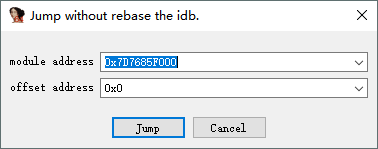
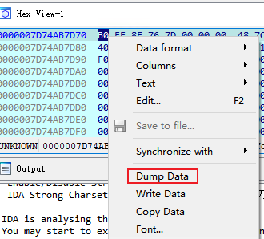
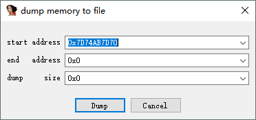
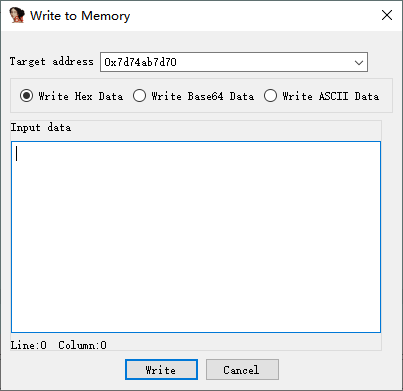
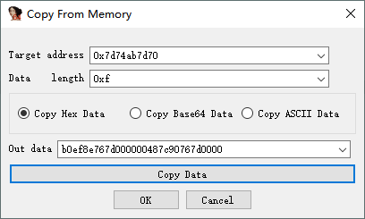

# Debugger Helper for IDA Pro

Add some auxiliary functions while debugging in IDA Pro.

## Supported Versions

Only effective during debugging.
* python 3.x
* IDA Pro 7.x
* IDA Pro 8.x
* IDA Pro 9.x

## Install

download **DebugHelper.py** from this repository and put it into your IDA Pro plugin directory.

## Features

### RVA Jump

During static analysis, we can obtain the offset of a specific function. During dynamic debugging, the module's base
address needs to be retrieved and added to the offset to get the actual address. The operation process can be
streamlined with the following steps:

Right-click in Debug View and select "RVA Jump." Fill in the offset to jump to.

### Sync HexView
Right-click in Debug View and select "Sync HexView", and the hex view will be synchronized with the debug view.

### dump memory to file

Right-click in Hex View and select "Dump Data." Fill in the start address and end address (or length) to export the
memory region to a file.

After entering the addresses, choose the location to save the file.

### Write Data To Memory

Supported data types:

* ASCII String
* Hex String
* Base64 String

Right-click in Hex View and select "Write Data." In the popup window, choose the data type to write

### Copy Data From Memory

Supported data types:

* ASCII String
* Hex String
* Base64 String

Right-click in Hex View and select "Copy Data." In the popup window, choose the data type to copy, and the specified
length of data will be copied to the clipboard.

